### 安装sonarqube
>预先准备mysql和jdk环境

1. 下载最新版本sonarqube包，[地址](https://www.sonarqube.org/downloads/)
2. 创建sonarqube库:CREATE DATABASE sonar CHARACTER SET utf8 COLLATE utf8_general_ci;
3. 创建sonar用户(sonar启动需要启动自带es，es默认不能用root用户启动)，切换到sonar用户
4. 解压sonarqube包，编辑conf文件夹中的sonar.properties数据库配置(sonar.jdbc.username,sonar.jdbc.password,sonar.jdbc.url),访问端口(sonar.web.port),访问路径(sonar.web.context)
5. 启动sonarqube，在浏览器访问配置的端口和路径
>linux启动脚本在bin/linux-x86-xx中
        启动 sh sonar.sh start
        停止 sh sonar.sh stop
  windows脚本在bin/windows-x86-xx中
        启动执行 StartSonar.bat
        停止手动关闭java进程
6. 常见问题
   * 启动失败可以检查logs文件夹中的日志文件，查看ce.log、es.log和web.log中有无报错
   * 确定不是使用root用户启动，且当前用户对sonarqube文件夹有权限，启动失败可以删除temp文件夹重启试试

### 与jenkins配合使用
1.  安装jenkins的SonarQube Scanner for Jenkins插件
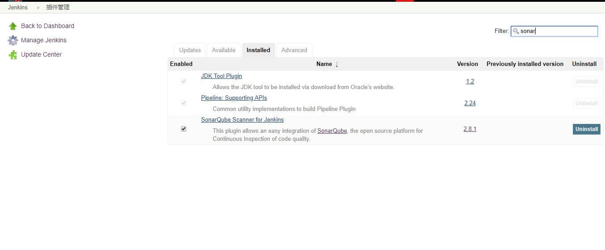
2.  在 jenkins的 >系统管理>系统设置中 配置sonarqube服务器
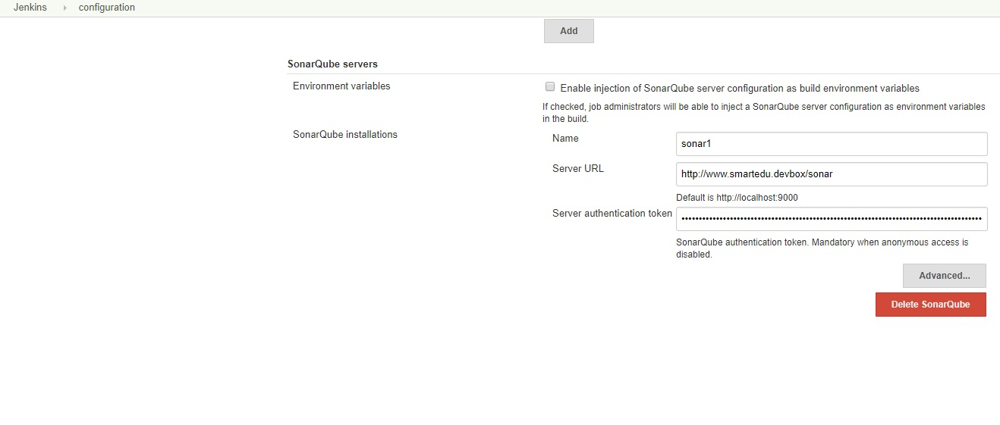
> 	Name随便起，Server URL是sonarqube访问地址，Server authentication token是jenkins访问sonarqube时需要使用的token，该token可以在sonarqube的用户界面生成

3.  在jenkins的 >全局工具配置 配置SonarQube Scanner
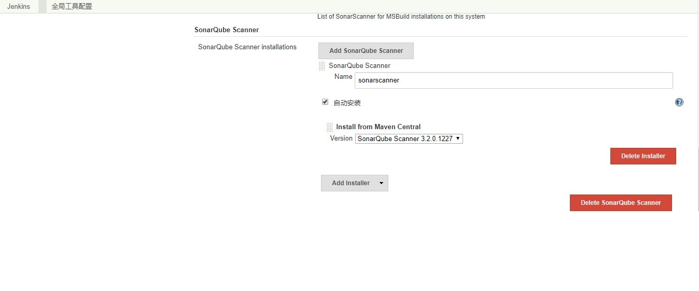
4.  在jenkins任务中增加sonarqube分析步骤
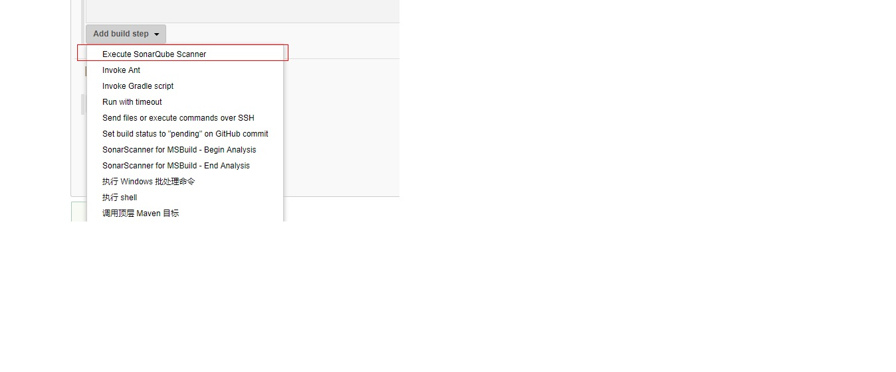
5.  配置分析步骤详细
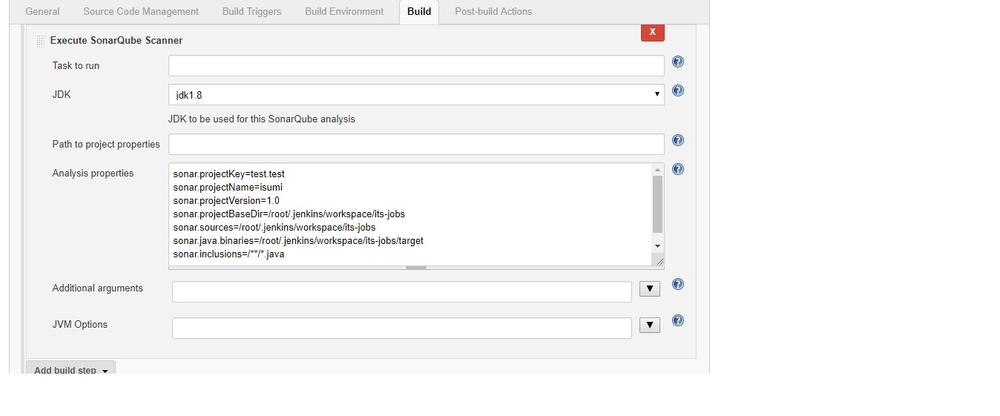
>     jdk没有可选的选项，请在全局工具中配置jdk的路劲
>     Analysis properties可选项在https://docs.sonarqube.org/display/SONAR/Analysis%20Parameters中查看
```
\#必填 项目key，在sonar权限管理中有用
sonar.projectKey=test.test
\#必填 项目在sonar中显示的名称
sonar.projectName=isumi
\#必填 版本
sonar.projectVersion=1.0
\#scanner工作目录,源代码的目录必须包含在此目录中，否则会报错
sonar.projectBaseDir=/root/.jenkins/workspace/its-jobs
\#必填 源代码所在的路劲
sonar.sources=/root/.jenkins/workspace/its-jobs
\#编译后的class文件所在路劲，java项目不填此项会报错
sonar.java.binaries=/root/.jenkins/workspace/its-jobs/target
\#筛选只扫描java文件
sonar.inclusions=/**/*.java
```

### sonarqube权限管理
1.  修改项目默认显示方式为私有，私有项目需要权限才能访问
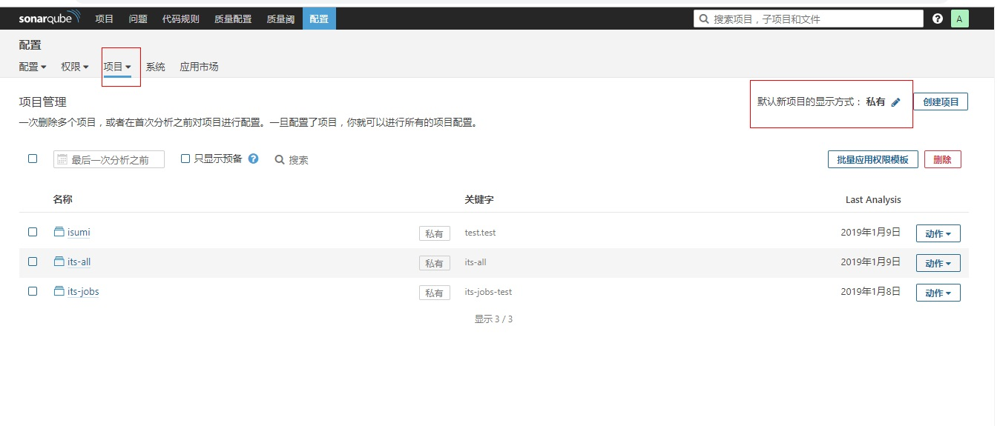
2.  新建群组its
> 任何人，sonar-administrators，sonar-users是sonarqube自带的群组
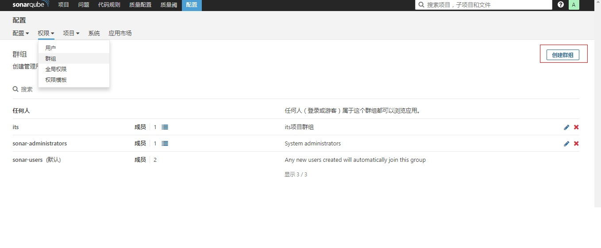

3.  新建default权限模板，并将其设置为默认权限模板
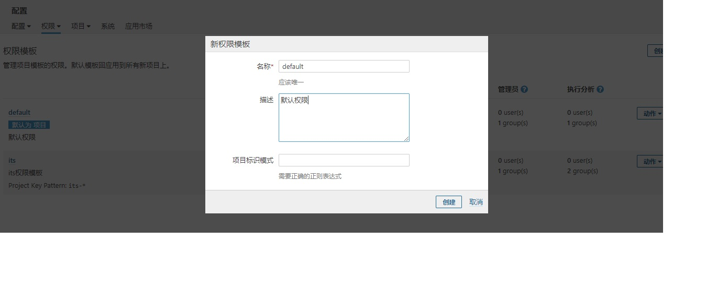
4.  点击defaut权限模板的 >动作>修改权限 ，选择群组标签，在搜索中搜索admin权限组，勾选所有操作权限。如此一来，所有新的sonarqube项目默认只有admin权限组才能操作
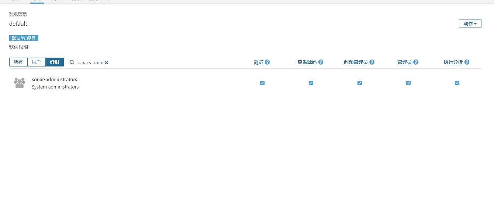
5.  新建its权限模板,在项目标识符中填`its-.+`,在新建项目的时候如果项目的projectkey是以its-开头的话，默认会对应上此权限模板，否则对应默认模板
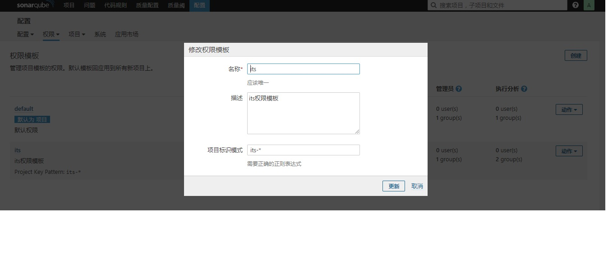
6.  修改its权限模板权限，将admin权限组合its权限组添加进去
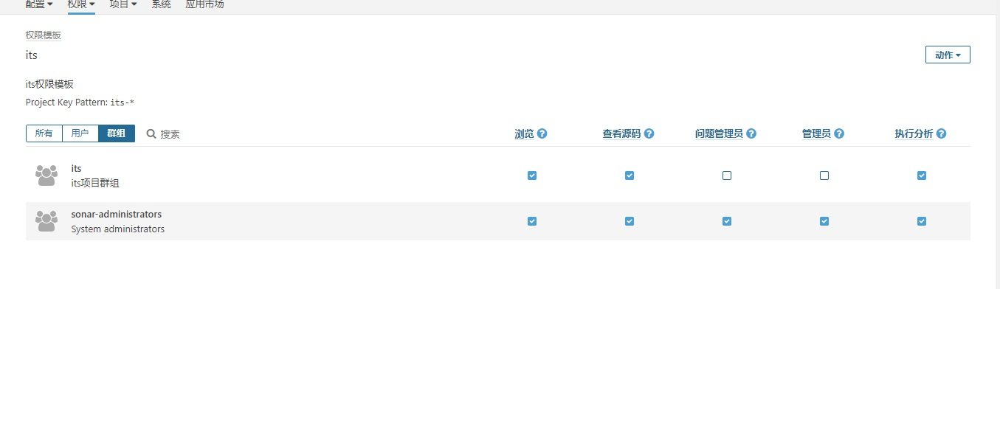
7.  创建its用户，将其分配到its权限组内
8.  如果有its-xxx的项目在还没有创建模板之前就创建了，可以在项目管理中批量应用
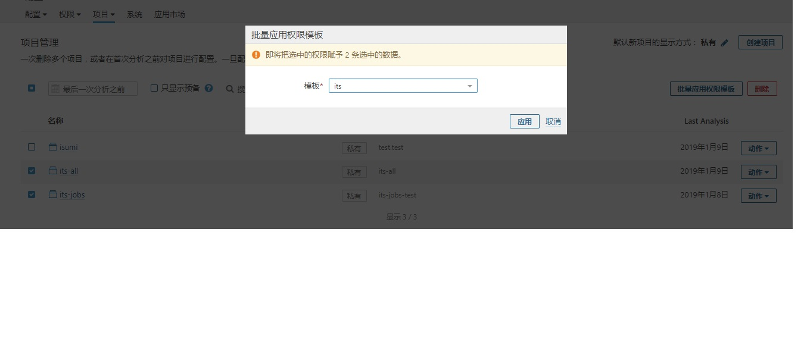

### sonarqube代码覆盖率
> 在maven中添加jacoco插件,在编译代码时不要跳过test步骤，jacoco会生成jacoco.exec

```
<plugin>
    <groupId>org.jacoco</groupId>
    <artifactId>jacoco-maven-plugin</artifactId>
    <version>0.7.8</version>
    <executions>
        <execution>
            <goals>
                <goal>prepare-agent</goal>
                <goal>report</goal>
            </goals>
        </execution>
    </executions>
</plugin>
```
